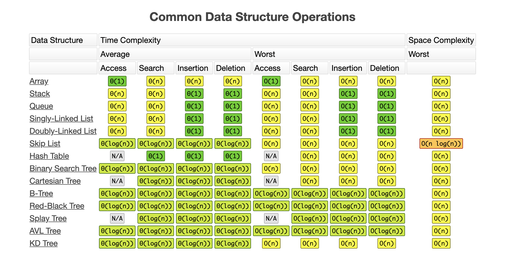

# 算法笔记

## 基础理论

### Big O Notation

大 O 标记法

- O(1)

```java
int n = 1000;
System.out.println("Hey - your input is: " + n);
```

- O(?)

```java
int n = 1000;
System.out.println("Hey - your input is: " + n); System.out.println("Hmm.. I'm doing more stuff with: " + n); System.out.println("And more: " + n);
```

- O(N)

```java
for (int = 1; i<=n; i++) {
    System.out.println(“Hey - I'm busy looking at: " + i);
}
```

- O(N^2)

```java
for (int i = 1; i <= n; i++) { 
    for (int j = 1; j <=n; j++) {
        System.out.println("Hey - I'm busy looking at: " + i + " and " + j); 
    }
}
```

- O(log(n))

```java
for (int i = 1; i < n; i = i * 2) {
    System.out.println("Hey - I'm busy looking at: " + i);
}
```

- O(k^n)

```java
for (int i = 1; i <= Math.pow(2, n); i++) {
    System.out.println("Hey - I'm busy looking at: " + i);
}
```

- O(n!)

```java
for (int i = 1; i <= factorial(n); i++) {
    System.out.println("Hey - I'm busy looking at: " + i);
}
```

### Master Theorem

主定理，wiki 地址：

- https://en.wikipedia.org/wiki/Master_theorem_(analysis_of_algorithms)

- https://zh.wikipedia.org/wiki/%E4%B8%BB%E5%AE%9A%E7%90%86

### 数据结构的效率



注：图片来源 [Know Thy Complexities!]([https://www.bigocheatsheet.com)

## 数组、链表(Array、Linked List)

LeetCode 的相关题目，地址如下：

- https://leetcode.com/problems/reverse-linked-list
- https://leetcode.com/problems/linked-list-cycle
  - 解法：
    - 快慢指针，slow 为 k ，fast 为 k + 1
    - 循环遍历入库
- https://leetcode.com/problems/swap-nodes-in-pairs
- https://leetcode.com/problems/linked-list-cycle-ii
- https://leetcode.com/problems/reverse-nodes-in-k-group

## 堆栈、队列列(Stack、Queue)

LeetCode 的相关题目，地址如下：

- https://leetcode.com/problems/implement-queue-using-stacks/solution
- https://leetcode.com/problems/implement-stack-using-queues/description
- https://leetcode.com/problems/valid-parentheses/description

## 优先队列 (PriorityQueue)

优先队列的内部实现的数据结构可以如下：

- Heap (Binary, Binomial, Fibonacci)
- Binary Search Tree

LeetCode 的相关题目，地址如下：

- https://leetcode.com/problems/kth-largest-element-in-a-stream/discuss/149050/Java-Priority-Queue
- https://leetcode.com/problems/sliding-window-maximum

## 哈希表(HashTable) & 集合(Set)

LeetCode 的相关题目，地址如下：

- https://leetcode.com/problems/valid-anagram/description
- https://leetcode.com/problems/two-sum/description
- https://leetcode.com/problems/3sum/description
- https://leetcode.com/problems/4sum
- https://leetcode.com/problems/group-anagrams/description

## 树、二叉树、二叉搜索树

二叉搜索树(英语: Binary Search Tree)，也称二叉搜索树、有序二叉树(英语: ordered binary tree)，排序二叉树(英语: sorted binary tree)，是指一棵空树或者具有下列列性质的二叉树:

1. 若任意节点的左⼦子树不不空，则左⼦子树上所有结点的值均⼩小于它的 根结点的值;
2. 若任意节点的右⼦子树不不空，则右⼦子树上所有结点的值均⼤大于它的 根结点的值;
3. 任意节点的左、右⼦子树也分别为⼆叉查找树。

LeetCode 的相关题目，地址如下：

- https://leetcode.com/problems/validate-binary-search-tree
- https://leetcode.com/problems/lowest-common-ancestor-of-a-binary-search-tree
- https://leetcode.com/problems/lowest-common-ancestor-of-a-binary-tree

## 二叉树遍历 Pre-order/In-order/Post-order

遍历顺序：

- 前序(Pre-order ): 根-左-右
- 中序( In-order ): 左-根-右
- 后序(Post-order): 左-右-根

## 递归、分治 (Recursion，Divide & Conquer)

LeetCode 的相关题目，地址如下：

- https://leetcode.com/problems/powx-n/description
- https://leetcode.com/problems/majority-element/description
- https://leetcode.com/problems/maximum-subarray/description
- https://leetcode.com/problems/valid-anagram/#/description
- https://leetcode.com/problems/find-all-anagrams-in-a-string/#/description
- https://leetcode.com/problems/anagrams/#/description

## 贪⼼算法 (Greedy Algorithms)

适⽤ Greedy 的场景简单地说，问题能够分解成⼦子问题来解决，子问题的最优解能递推到最终问题的最优解。这种子问题最优解成为最优子结构。

贪⼼算法与动态规划的不同在于它对每个子问题的解决方案都做出选择，不能回退。动态规划则会保存以前的运算结果，并根据以前的结果对当前进行选择， 有回退功能。

LeetCode 的相关题目，地址如下：

- https://leetcode.com/problems/best-time-to-buy-and-sell-stock-ii/description
- https://leetcode.com/problems/lemonade-change/description
- https://leetcode.com/problems/assign-cookies/description
- https://leetcode.com/problems/walking-robot-simulation/description

## 广度优先搜索 (Breadth-First-Search) / 深度优先搜索(Depth-First-Search)

LeetCode 的相关题目，地址如下：

- https://leetcode.com/problems/binary-tree-level-order-traversal
- https://leetcode.com/problems/maximum-depth-of-binary-tree
- https://leetcode.com/problems/minimum-depth-of-binary-tree/description
- https://leetcode.com/problems/generate-parentheses

## 剪枝

LeetCode 的相关题目，地址如下：

- https://leetcode.com/problems/n-queens
- https://leetcode.com/problems/n-queens-ii
- https://leetcode.com/problems/valid-sudoku/description
- https://leetcode.com/problems/sudoku-solver/#/description

## 二分查找 (Binary Search)

Sorted (单调递增或者递减) ，Bounded(存在上下界) ，Accessible by index(能够通过索引访问)

LeetCode 的相关题目，地址如下：

- https://leetcode.com/problems/sqrtx
- https://leetcode.com/problems/valid-perfect-square

相关拓展阅读：

- https://www.beyond3d.com/content/articles/8

## 字典树 (Trie)

Trie树，即字典树，又称单词查找树或键树，是一种树形结构，是⼀种哈希树的变种。典型应用是⽤用统计和排序⼤量的字符串(但不仅限于字符串)，所以经常被搜索引擎系统⽤于文本词频统计。

它的优点是:最⼤限度地减少无谓的字符串⽐较，查询效率比哈希表⾼。

Trie的核⼼思想是空间换时间。利⽤字符串的公共前缀来降低查询时间的开销以达到提高效率的⽬的。

LeetCode 的相关题目，地址如下：

- https://leetcode.com/problems/implement-trie-prefix-tree/#/description
- https://leetcode.com/problems/word-search-ii

相关拓展阅读：

- 系统设计: search suggestion 搜索建议

## 位运算的运⽤ (Bitwise operations)

LeetCode 的相关题目，地址如下：

- https://leetcode.com/problems/number-of-1-bits
- https://leetcode.com/problems/power-of-two
- https://leetcode.com/problems/counting-bits/description
- https://leetcode.com/problems/n-queens-ii/description

## 动态规划(Dynamic Programming)

LeetCode 的相关题目，地址如下：

- https://leetcode.com/problems/climbing-stairs/description
- https://leetcode.com/problems/triangle/description
- https://leetcode.com/problems/maximum-product-subarray/description
- https://leetcode.com/problems/best-time-to-buy-and-sell-stock/#/description
- https://leetcode.com/problems/best-time-to-buy-and-sell-stock-ii
- https://leetcode.com/problems/best-time-to-buy-and-sell-stock-iii
- https://leetcode.com/problems/best-time-to-buy-and-sell-stock-iv
- https://leetcode.com/problems/best-time-to-buy-and-sell-stock-with-cooldown
- https://leetcode.com/problems/best-time-to-buy-and-sell-stock-with-transaction-fee
- https://leetcode.com/problems/longest-increasing-subsequence
- https://leetcode.com/problems/coin-change
- https://leetcode.com/problems/edit-distance

## 并查集

并查集 (union & find) 是⼀种树型的数据结构，用于处理⼀些不交集(Disjoint Sets)的合并及查询问题。

- Find:确定元素属于哪一个子集。它可以被用来确定两个元素是否属于同⼀子集。

- Union:将两个⼦集合并成同⼀个集合。

LeetCode 的相关题目，地址如下：

- https://leetcode.com/problems/number-of-islands
- https://leetcode.com/problems/friend-circles

## LRU Cache

LeetCode 的相关题目，地址如下：

- https://leetcode.com/problems/lru-cache

相关拓展阅读：

- https://zh.wikipedia.org/wiki/快取⽂文件置換機制
- https://en.wikipedia.org/wiki/Cache_replacement_policies

## Bloom Filter (布隆过滤器)

⼀个很长的二进制向量和一系列随机映射函数。布隆过滤器可以⽤于检索一个元素是否在一个集合中。它的优点是空间效率和查询时间都远超过一般的算法，缺点是有⼀定的误识别率和删除困难。

LeetCode 的相关题目，地址如下：

- 暂无

## 总结

需要刻意练习，和思考相关的问题。不然，只停留于片段是不能解决问题的。
